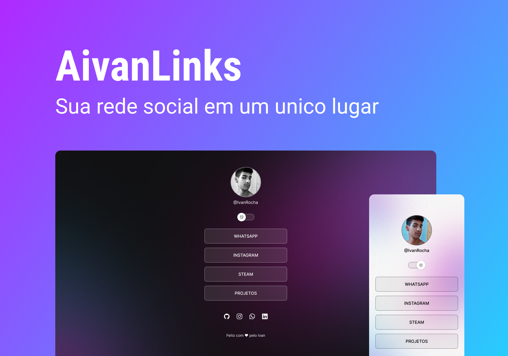

## AivanLinks

O projeto AivanLinks tem como objetivo facilitar o acesso de "Visitantes" a uma determinada rede social. Por exemplo o Instagram.

## Demonstração

## 💻 Tech Stack:
   

## Licença

[MIT License](https://choosealicense.com/licenses/mit/)

## Suporte

Para suporte, mande um email para ivan.rocha.0987@gmail.com ou entre em contato pelo whatsapp (41) 98468-5317.

## Feedback

Se você tiver algum feedback, por favor enviar para ivan.rocha.0987@gmail.com

## Autor

- [@IvanRocha](https://www.github.com/ivanrocha10)
