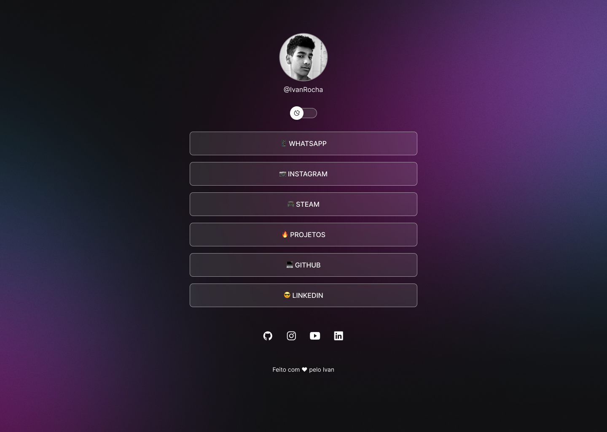

# AivanLinks

O projeto AivanLinks, foi desenvolvido através de um "curso" preparatório para iniciantes na programação, o curso é fornecido pela Rocketseat.

O Projeto AivanLinks, tem como objetivo ajudar o cliente a se achar nas redes sociais de uma pessoa, empresa, negócio, etc....

## Demonstração

## 💻 Tech Stack:
    

## Material

https://www.figma.com/community/file/1187422022288947321/DevLinks

## Licença

[MIT License](https://choosealicense.com/licenses/mit/)

## Suporte

Para suporte, mande um email para ivan.rocha.0987@gmail.com ou entre em contato via whatsapp (41) 98468-5317.

## Feedback

Se você tiver algum feedback, por favor enviar para ivan.rocha.0987@gmail.com

## Autores

- [@IvanRocha](https://www.github.com/ivanrocha10)
- [@Rocketseat](https://github.com/Rocketseat)

## Projeto

  Acesse o "AivanLinks" pelo QR:

  

Caso o QR não funcione, acesse <a href="https://ivanrocha10.github.io/AivanLinks/">aqui</a>
